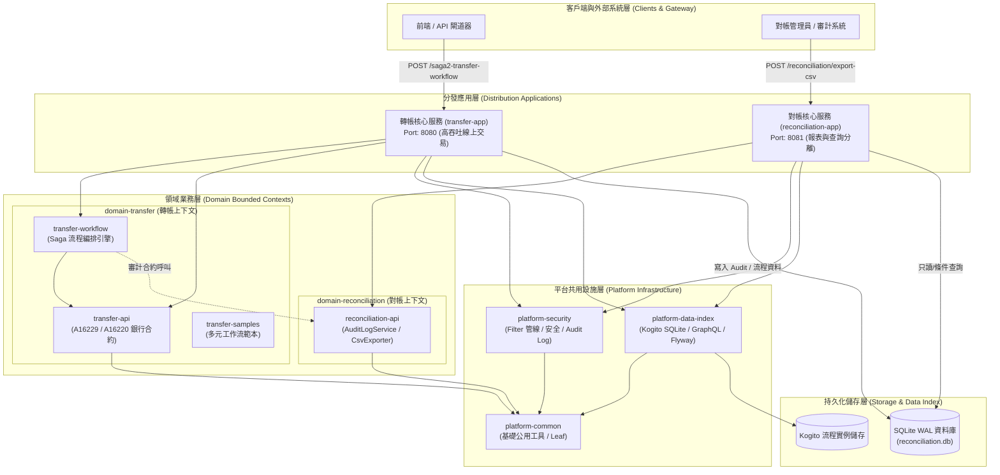
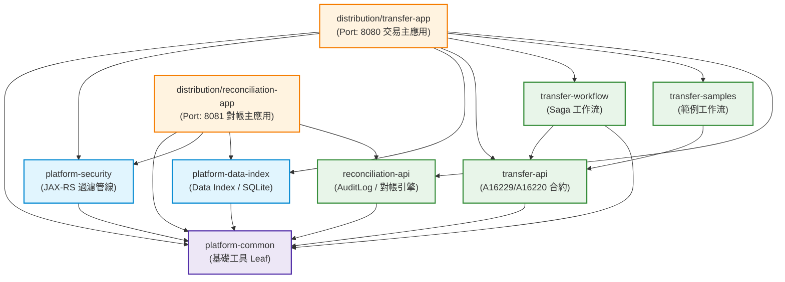
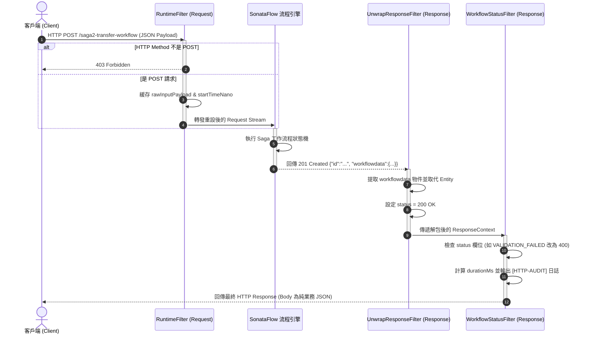
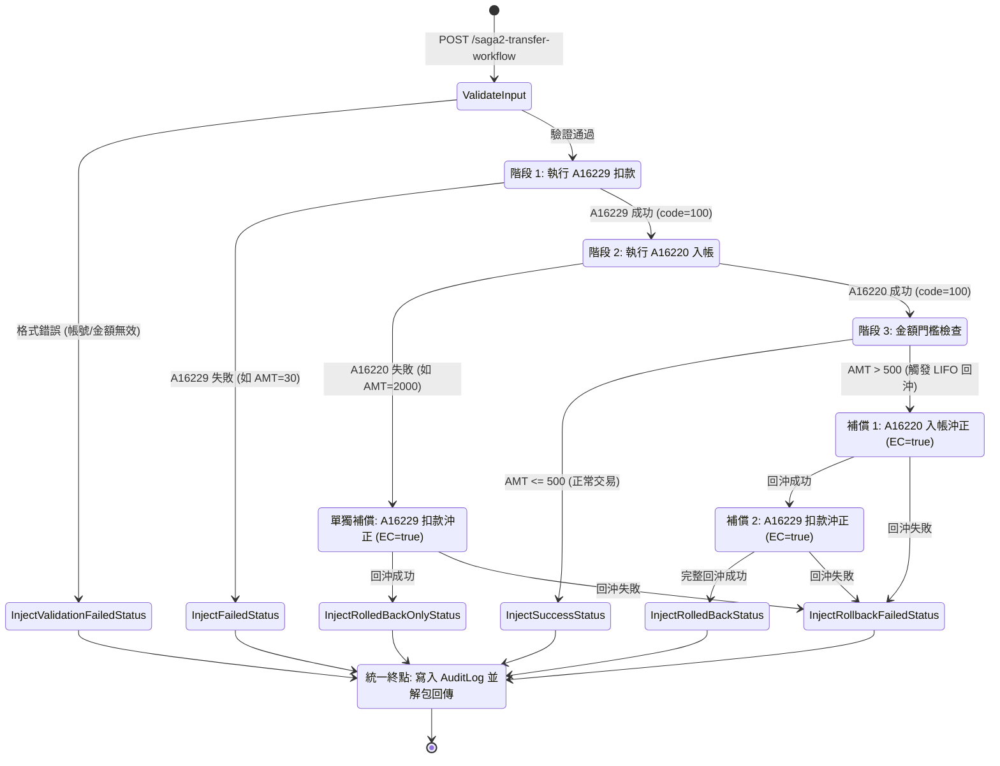
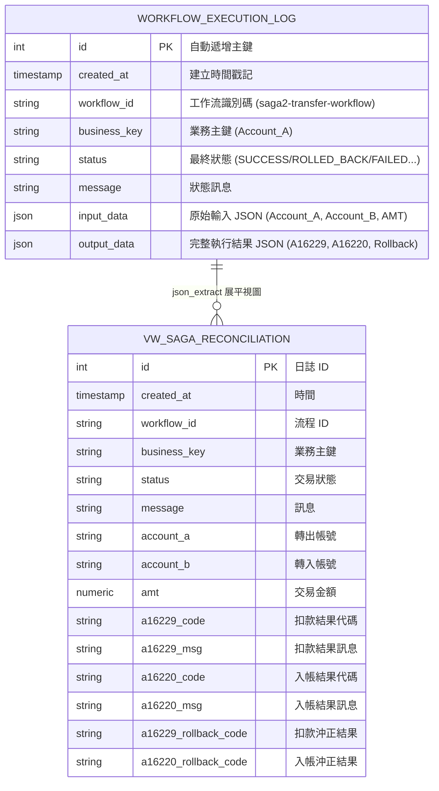
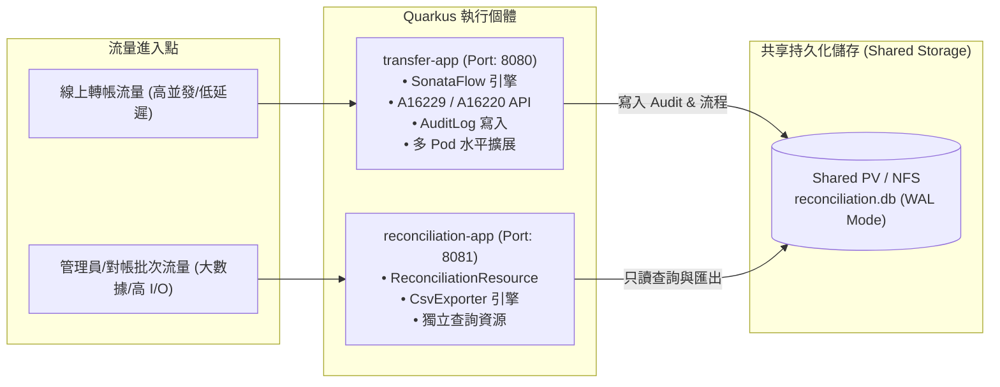
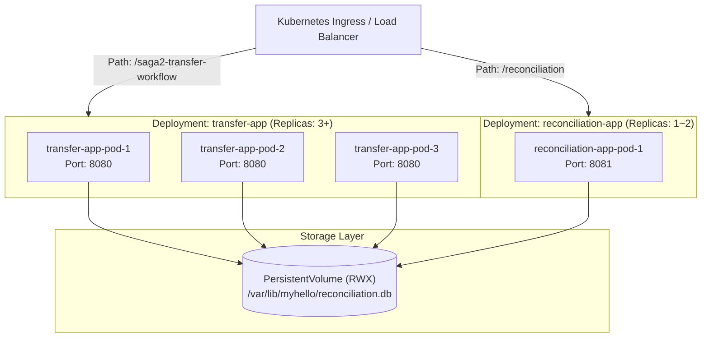
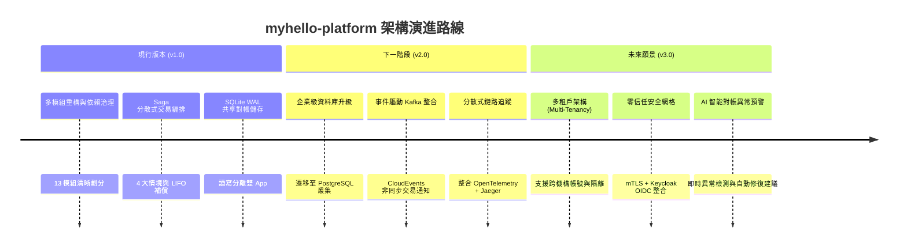

# myhello-platform 企業級多模組系統架構說明文件

> **版本**：v1.0.0-SNAPSHOT  
> **技術核心**：Quarkus 3.27.2 + Apache Kogito / SonataFlow (Serverless Workflow) + SQLite WAL / PostgreSQL  
> **文件目的**：提供開發團隊、架構師與維運團隊完整、詳盡之系統架構設計、模組職責、分散式 Saga 交易機制、資料流與部署指引。

---

## 目錄 (Table of Contents)

- [第 1 章：系統架構總覽 (System Architecture Overview)](#第-1-章系統架構總覽-system-architecture-overview)
  - [1.1 系統定位與願景](#11-系統定位與願景)
  - [1.2 設計原則與架構哲學](#12-設計原則與架構哲學)
  - [1.3 總體架構圖](#13-總體架構圖)
  - [1.4 技術棧矩陣](#14-技術棧矩陣)
- [第 2 章：多模組架構與依賴治理 (Multi-Module Architecture & Dependency Governance)](#第-2-章多模組架構與依賴治理-multi-module-architecture--dependency-governance)
  - [2.1 模組分層體系](#21-模組分層體系)
  - [2.2 模組職責定義表](#22-模組職責定義表)
  - [2.3 模組依賴有向無環圖 (DAG)](#23-模組依賴有向無環圖-dag)
  - [2.4 架構守則與核心不變式](#24-架構守則與核心不變式)
- [第 3 章：平台基礎設施層 (Platform Infrastructure Layer)](#第-3-章平台基礎設施層-platform-infrastructure-layer)
  - [3.1 platform-common (公用工具層)](#31-platform-common-公用工具層)
  - [3.2 platform-security (安全與過濾管線)](#32-platform-security-安全與過濾管線)
  - [3.3 platform-data-index (流程實例索引與持久化)](#33-platform-data-index-流程實例索引與持久化)
  - [3.4 請求/回應過濾管線時序圖](#34-請求回應過濾管線時序圖)
- [第 4 章：轉帳業務領域層與 Saga 分散式交易 (Domain-Transfer & Saga Workflow)](#第-4-章轉帳業務領域層與-saga-分散式交易-domain-transfer--saga-workflow)
  - [4.1 transfer-api (銀行雙階段介面合約)](#41-transfer-api-銀行雙階段介面合約)
  - [4.2 transfer-workflow (SonataFlow 工作流編排)](#42-transfer-workflow-sonataflow-工作流編排)
  - [4.3 四大 Saga 業務情境與補償決策](#43-四大-saga-業務情境與補償決策)
  - [4.4 Saga 交易狀態流轉與補償時序圖](#44-saga-交易狀態流轉與補償時序圖)
  - [4.5 transfer-samples (多元流程示範)](#45-transfer-samples-多元流程示範)
- [第 5 章：對帳與審計領域層 (Domain-Reconciliation & Audit Logging)](#第-5-章對帳與審計領域層-domain-reconciliation--audit-logging)
  - [5.1 reconciliation-api (審計與對帳引擎)](#51-reconciliation-api-審計與對帳引擎)
  - [5.2 核心資料模型與視圖](#52-核心資料模型與視圖)
  - [5.3 資料庫實體關聯圖 (ER Diagram)](#53-資料庫實體關聯圖-er-diagram)
  - [5.4 ReconciliationCsvExporter (高效能 CSV 匯出引擎)](#54-reconciliationcsvexporter-高效能-csv-匯出引擎)
- [第 6 章：分發與部署架構 (Distribution & Deployment Architecture)](#第-6-章分發與部署架構-distribution--deployment-architecture)
  - [6.1 雙執行應用體系設計](#61-雙執行應用體系設計)
  - [6.2 儲存拓撲與共享 Volume 模型](#62-儲存拓撲與共享-volume-模型)
  - [6.3 構建生命週期與資源自動同步](#63-構建生命週期與資源自動同步)
  - [6.4 Kubernetes 容器化部署拓撲](#64-kubernetes-容器化部署拓撲)
- [第 7 章：API 介面合約與通訊協定 (API Contracts & Protocols)](#第-7-章api-介面合約與通訊協定-api-contracts--protocols)
  - [7.1 RESTful API 介面規格](#71-restful-api-介面規格)
  - [7.2 GraphQL API 介面規格](#72-graphql-api-介面規格)
- [第 8 章：運維監控與高可用性設計 (Operations, Observability & HA)](#第-8-章運維監控與高可用性設計-operations-observability--ha)
  - [8.1 系統健康檢查與指標監控](#81-系統健康檢查與指標監控)
  - [8.2 審計軌跡日誌追蹤](#82-審計軌跡日誌追蹤)
  - [8.3 故障恢復與人工介入指引](#83-故障恢復與人工介入指引)
  - [8.4 未來架構演進路線圖](#84-未來架構演進路線圖)

---

## 第 1 章：系統架構總覽 (System Architecture Overview)

### 1.1 系統定位與願景

`myhello-platform` 是一個專為金融級分散式交易編排與即時對帳所打造的雲原生微服務平台。本專案從早期單一模組架構（Monolith）演進為**高內聚、低耦合、領域驅動（DDD）的多模組架構**。平台以 CNCF Serverless Workflow 規格為基礎，結合 Quarkus 響應式框架與 Apache Kogito 引擎，提供毫秒級啟動、低記憶體佔用、以及強一致性的分散式交易與審計能力。

### 1.2 設計原則與架構哲學

1. **領域驅動設計 (Domain-Driven Design, DDD)**：
   - 清楚劃分邊界上下文（Bounded Contexts），分離「轉帳交易 (`domain-transfer`)」與「對帳審計 (`domain-reconciliation`)」，使各業務領域模型與生命週期獨立演進。
2. **Saga 分散式交易模式 (Saga Pattern with Orchestration)**：
   - 採用**協調者編排模式（Orchestrator-based Saga）**，透過聲明式工作流定義 (`.sw.yaml`) 明確管理正向交易（扣款、入帳）與逆向補償交易（EC 沖正），具備 LIFO（後進先出）完整回沖與短路容錯能力。
3. **分層架構與單向依賴 (Clean Architecture & Unidirectional DAG)**：
   - 嚴格遵守「平台層 $\rightarrow$ 領域層 $\rightarrow$ 分發層」單向依賴規則，底層模組對上層業務無感知，杜絕任何循環依賴。
4. **讀寫負載分離 (Read/Write Separation Distribution)**：
   - 線上高吞吐交易服務 (`transfer-app`) 與離線對帳報表匯出服務 (`reconciliation-app`) 打包為獨立執行個體，保障核心交易不受繁重對帳查詢干擾。

### 1.3 總體架構圖



### 1.4 技術棧矩陣

| 維度 | 技術選型 | 版本 / 規格 | 採用理由與架構優勢 |
| :--- | :--- | :--- | :--- |
| **基礎框架** | Quarkus Framework | 3.27.2 | 超快啟動（< 3s）、低記憶體開銷、原生支援 GraalVM Native 與熱重載 |
| **流程編排** | Apache Kogito / SonataFlow | 10.2.0 | CNCF Serverless Workflow 標準規格，JSONPath/jq 支援，聲明式 Saga |
| **資料持久化** | Agroal + Flyway + SQLite / PG | SQLite 3.45.1 | WAL 模式支援高並發讀寫；支援零外部依賴本地運行與企業級 PostgreSQL 無縫切換 |
| **流程索引** | Kogito Data Index | 10.2.0 | GraphQL 介面支援 ProcessInstances 即時查詢與歷程追蹤 |
| **API 標準** | OpenAPI 3.0 / SmallRye OpenAPI | 3.0.3 | 契約優先（Contract-First），自動產生 JAX-RS 與 Swagger UI |
| **構建系統** | Apache Maven | 3.8+ (Java 21) | Reactor 13 模組精準構建，配合 Jandex 3.2.7 自動生成 CDI 索引 |

---

## 第 2 章：多模組架構與依賴治理 (Multi-Module Architecture & Dependency Governance)

### 2.1 模組分層體系

整個專案由 13 個 Maven 模組組成，共分為四個水平與垂直層次：

1. **Root POM (`myhello-platform`)**：定義全域依賴版本（BOM）、共用編譯外掛（Compiler, Jandex, Surefire）。
2. **Platform Layer（平台層）**：提供與業務無關的底層設施，包含公用工具、安全攔截器、資料索引。
3. **Domain Layer（業務領域層）**：依據業務上下文獨立劃分的轉帳與對帳領域模組。
4. **Distribution Layer（發布層）**：負責裝配特定業務與平台能力，產生最終的可執行二進制容器/JAR。

```
myhello-platform/ (Root Parent POM)
├── platform-common/                     [平台] 公用工具層 (Leaf)
├── platform-security/                   [平台] JAX-RS 安全、解包與狀態碼改寫過濾器
├── platform-data-index/                 [平台] Data Index 實例索引與 SQLite/Flyway
├── domain-transfer/                     [領域] 轉帳業務聚合根 (Parent POM)
│   ├── transfer-api/                    [領域] A16229 / A16220 DTO、規格與 Mock 服務
│   ├── transfer-workflow/               [領域] Saga 流程定義與服務調用封裝
│   └── transfer-samples/                [領域] OpenAPI / Java / REST 工作流範本
├── domain-reconciliation/               [領域] 對帳業務聚合根 (Parent POM)
│   └── reconciliation-api/              [領域] 審計日誌服務 (AuditLog) 與 CSV 匯出引擎
└── distribution/                        [分發] 應用組裝聚合根 (Parent POM)
    ├── transfer-app/                    [應用] 線上交易主應用 (Port 8080)
    └── reconciliation-app/              [應用] 離線對帳與查詢應用 (Port 8081)
```

### 2.2 模組職責定義表

| 模組名稱 | 類型 | 核心職責與封裝內容 | 主要輸出與 Artifact |
| :--- | :---: | :--- | :--- |
| `platform-common` | Library | 無任何第三方框架依賴之純 Java 基礎工具、常數、共用型別 | `platform-common.jar` |
| `platform-security` | Library | JAX-RS Filter 管線：`RuntimeFilter`、`UnwrapResponseFilter`、`WorkflowStatusFilter`、`SwaggerFilter` | `platform-security.jar` |
| `platform-data-index` | Library | Kogito Data Index SQLite 擴展、自訂 Hibernate 方言、Flyway 初始化、Liveness 健康檢查 | `platform-data-index.jar` |
| `transfer-api` | Domain | 銀行轉帳合約：A16229 (扣款) 與 A16220 (入帳) 之 OpenAPI YAML、DTO 物件與 JAX-RS Mock 資源 | `transfer-api.jar` |
| `transfer-workflow` | Domain | SonataFlow 工作流定義 (`saga2-transfer-workflow.sw.yaml`)、輸入 Schema、SagaApiService、MyOpenApiService | `transfer-workflow.jar` |
| `transfer-samples` | Domain | 範例工作流定義：`OpenAPI-workflow.sw.yaml`、`java-workflow.sw.yaml`、`rest-workflow.sw.yaml` | `transfer-samples.jar` |
| `reconciliation-api` | Domain | 審計日誌收集服務 (`AuditLogService`)、對帳資料庫視圖定義、高效能對帳 CSV 匯出引擎 (`ReconciliationCsvExporter`) | `reconciliation-api.jar` |
| `transfer-app` | App | 線上交易執行實體，聚合平台層 + 轉帳領域 + 對帳審計，提供 Port 8080 REST & GraphQL | `quarkus-app/quarkus-run.jar` |
| `reconciliation-app` | App | 獨立對帳查詢執行實體，聚合平台層 + 對帳領域，提供 Port 8081 對帳報表服務 | `quarkus-app/quarkus-run.jar` |

### 2.3 模組依賴有向無環圖 (DAG)



### 2.4 架構守則與核心不變式

1. **單向依賴律（Downward Dependency Rule）**：
   - 依賴關係嚴格由上至下（App $\rightarrow$ Domain $\rightarrow$ Platform $\rightarrow$ Leaf）。
   - 嚴禁底層 `platform-*` 依賴任何 `domain-*` 模組。
2. **跨領域隔離律（Cross-Domain Isolation Rule）**：
   - `domain-transfer` 內部不可直接依賴 `domain-reconciliation` 的實作類別；跨領域通信僅透過介面合約或 CDI 動態查找。
3. **單一組裝原則（Assembly Single-Point Rule）**：
   - 僅有 `distribution/*` 模組允許同時依賴多個領域模組並負責組裝完整的微服務應用程式。
4. **無循環依賴（Acyclic Dependency Rule）**：
   - Maven Reactor 構建過程中保證 100% DAG，杜絕任何形式的循環依賴。

---

## 第 3 章：平台基礎設施層 (Platform Infrastructure Layer)

### 3.1 `platform-common` (公用工具層)

作為整個專案的 Leaf 模組，不依賴任何外部框架（如 Quarkus、Spring），確保可以在任何標準 Java 環境中被安全引用。主要提供通用資料處理、格式轉換與型別常數。

### 3.2 `platform-security` (安全與過濾管線)

本模組透過 JAX-RS 標準的 `ContainerRequestFilter` 與 `ContainerResponseFilter` 構建了完整的 HTTP 安全與審計管線，並由 Quarkus Arc 依賴注入管理：

1. **`RuntimeFilter` (請求限制與 Payload 緩存)**：
   - **優先級**：`@Priority(Priorities.USER)`
   - **方法限制**：非 `POST` 請求（排除 `/q/*` 系統監控路徑）直接回傳 `403 Forbidden`（`{"error": "Only POST method is allowed"}`）。
   - **Payload 緩存**：利用 `ByteArrayInputStream` 讀取並重新封裝 Request Entity Stream，將原始 JSON Payload 與開始時間戳記緩存於 `requestContext` 中，避免 Stream 耗盡並供後續審計使用。
2. **`UnwrapResponseFilter` (工作流回應解包)**：
   - **優先級**：`@Priority(Priorities.USER)`
   - **解包機制**：Kogito 產生的工作流回應預設格式為 `{"id": "uuid", "workflowdata": { ... }}`。本過濾器自動攔截並提取 `workflowdata` 物件直接回傳給調用端，隱藏引擎層元數據，保持業務 API 簡潔性。
3. **`WorkflowStatusFilter` (狀態碼改寫與 HTTP 審計日誌)**：
   - **優先級**：`@Priority(Priorities.USER + 10)`
   - **狀態碼映射**：
     - `status == "VALIDATION_FAILED"` $\rightarrow$ 改寫為 `HTTP 400 Bad Request`
     - `status == "ROLLBACK_FAILED"` $\rightarrow$ 改寫為 `HTTP 409 Conflict`
     - `status == "SUCCESS" | "FAILED" | "ROLLED_BACK"` $\rightarrow$ 保持 `HTTP 200 OK`
   - **HTTP Audit Log**：統一輸出包含 URI、HTTP Code、執行耗時 (ms)、原始 Input Payload 與最終 Output Payload 之日誌（格式：`[HTTP-AUDIT] URI: ... | HTTP: ... | Cost: ...ms | INPUT: ... | OUTPUT: ...`）。
4. **`SwaggerFilter` / `OpenApiFilter` (API 規格動態過濾)**：
   - 在 OpenAPI 規格產生時動態過濾端點，確保敏感或內部管理 API 不對外暴露。

### 3.3 `platform-data-index` (流程實例索引與持久化)

為 SonataFlow 流程引擎提供即時狀態儲存與 GraphQL 查詢能力：

1. **SQLite 自訂方言 (`KogitoSQLiteDialect`)**：
   - 繼承 Hibernate `org.hibernate.dialect.SQLiteDialect`，解決 SQLite 無原生日期時間欄位型別問題，註冊 `SqliteZonedDateTimeJdbcType`，確保時區資料精準儲存。
2. **Flyway 自動資料庫遷移**：
   - 啟動時自動掃描 `db/migration`，自動建立 Data Index 相關之 `definitions`、`processes`、`nodes` 等流程狀態索引表。
3. **健康檢查機制 (`MyLivenessCheck`)**：
   - 實作 SmallRye Health `Liveness` 介面，隨時回報流程引擎與資料庫連線之存活狀態。

### 3.4 請求/回應過濾管線時序圖



---

## 第 4 章：轉帳業務領域層與 Saga 分散式交易 (Domain-Transfer & Saga Workflow)

### 4.1 `transfer-api` (銀行雙階段介面合約)

定義標準金融轉帳通訊協定，包含扣款與入帳兩大核心服務，並內建沖正（EC, Error Correction）標記：

- **A16229 服務 (扣款 / 轉出)**：
  - **端點**：`POST /A16229`
  - **Request**：`{"Account_A": "123456", "AMT": 100, "EC": false}`
  - **業務規則**：`AMT > 50` 成功回傳 `100`；`AMT <= 50` 拒絕交易回傳 `999` (HTTP 403)。
- **A16220 服務 (入帳 / 轉入)**：
  - **端點**：`POST /A16220`
  - **Request**：`{"Account_B": "A12345", "AMT": 100, "EC": false}`
  - **業務規則**：`AMT < 1000` 成功回傳 `100`；`AMT >= 1000` 拒絕交易回傳 `999` (HTTP 403)。
- **EC (Error Correction) 補償交易機制**：
  - 當正向交易需要回沖時，帶入 `EC: true` 參數再次呼叫對應 API，將款項原路沖正，回傳訊息為 `成功(EC)`。

### 4.2 `transfer-workflow` (SonataFlow 工作流編排)

核心流程檔 `saga2-transfer-workflow.sw.yaml` 遵循 CNCF Serverless Workflow 規格編寫，由 Java 服務 `SagaApiService` 提供底層 REST 客戶端呼叫，具備狀態轉移、資料抽取（jq）、條件分支與異常補償控制。

### 4.3 四大 Saga 業務情境與補償決策

平台支援完整的 Saga 狀態決策樹，涵蓋 4 種典型金融業務情境：

| 情境編號 | 觸發條件 | A16229 (扣款) | A16220 (入帳) | 觸發補償 (Compensations) | 最終狀態 (`status`) | 業務含義 |
| :---: | :--- | :---: | :---: | :--- | :---: | :--- |
| **情境 1** | $50 < \text{AMT} \le 500$ (如 100) | 成功 (`100`) | 成功 (`100`) | 無 | `SUCCESS` | 交易雙向成功完成 |
| **情境 2** | $\text{AMT} > 500$ (如 600) | 成功 (`100`) | 成功 (`100`) | **LIFO 完整回沖**：<br/>1. A16220 EC (入帳回沖)<br/>2. A16229 EC (扣款回沖) | `ROLLED_BACK` | 超過單筆上限，自動依後進先出完整回沖 |
| **情境 3** | $\text{AMT} \le 50$ (如 30) | 失敗 (`999`) | 未執行 (短路) | 無需回沖 | `FAILED` | 第一階段扣款失敗，立即中斷短路，不執行後續步驟 |
| **情境 4** | $\text{AMT} \ge 1000$ (如 2000) | 成功 (`100`) | 失敗 (`999`) | **部分回沖**：<br/>僅回沖 A16229 EC | `ROLLED_BACK` | 第二階段入帳失敗，僅需將第一階段扣款回沖 |

### 4.4 Saga 交易狀態流轉與補償時序圖



### 4.5 `transfer-samples` (多元流程示範)

展示 SonataFlow 呼叫外部服務的三種標準方式：
1. **OpenAPI Function (`OpenAPI-workflow.sw.yaml`)**：基於 OpenAPI 規格自動產生客戶端並呼叫。
2. **Custom Java CDI (`java-workflow.sw.yaml`)**：透過 `services.ApiService` 執行自訂 Java 商業邏輯。
3. **Generic REST (`rest-workflow.sw.yaml`)**：直接呼叫標準 HTTP REST 端點。

---

## 第 5 章：對帳與審計領域層 (Domain-Reconciliation & Audit Logging)

### 5.1 `reconciliation-api` (審計與對帳引擎)

`domain-reconciliation` 專注於交易完成後之審計軌跡儲存、對帳資料模型維護與報表匯出：

1. **`AuditLogService` (非阻塞審計寫入)**：
   - 負責將工作流傳入之 `workflowId`、`businessKey`、`inputData`、`outputData` 解析並寫入 SQLite 資料庫。
   - 透過 WAL（Write-Ahead Logging）模式保證寫入時不阻塞查詢操作。
2. **`ReconciliationResource` (對帳 REST API)**：
   - 提供 `/reconciliation/export-csv` 介面，供管理人員或批次作業觸發對帳報表匯出。

### 5.2 核心資料模型與視圖

對帳資料庫採用結構化日誌表與即時展平視圖設計：

1. **底層日誌表：`workflow_execution_log`**
   - 儲存所有工作流執行之完整 JSON 請求與回應：
     - `id` (INTEGER PRIMARY KEY AUTOINCREMENT)
     - `created_at` (TIMESTAMP DEFAULT CURRENT_TIMESTAMP)
     - `workflow_id` (TEXT)
     - `business_key` (TEXT)
     - `status` (TEXT: `SUCCESS`, `ROLLED_BACK`, `FAILED`, `VALIDATION_FAILED`, `ROLLBACK_FAILED`)
     - `message` (TEXT)
     - `input_data` (JSON TEXT)
     - `output_data` (JSON TEXT)

2. **對帳核心視圖：`vw_saga_reconciliation`**
   - 利用 SQLite `json_extract()` 函數將 JSON 欄位即時解析展平成扁平欄位，供高效 SQL 查詢與報表導出：
   ```sql
   CREATE VIEW IF NOT EXISTS vw_saga_reconciliation AS
   SELECT 
       id,
       created_at,
       workflow_id,
       business_key,
       status,
       message,
       json_extract(input_data, '$.Account_A') AS account_a,
       json_extract(input_data, '$.Account_B') AS account_b,
       json_extract(input_data, '$.AMT')       AS amt,
       json_extract(output_data, '$.a16229Result.code') AS a16229_code,
       json_extract(output_data, '$.a16229Result.message') AS a16229_msg,
       json_extract(output_data, '$.a16220Result.code') AS a16220_code,
       json_extract(output_data, '$.a16220Result.message') AS a16220_msg,
       json_extract(output_data, '$.a16229Rollback.code') AS a16229_rollback_code,
       json_extract(output_data, '$.a16220Rollback.code') AS a16220_rollback_code
   FROM workflow_execution_log;
   ```

### 5.3 資料庫實體關聯圖 (ER Diagram)



### 5.4 `ReconciliationCsvExporter` (高效能 CSV 匯出引擎)

1. **記憶體安全與串流寫入**：採用 JDBC `PreparedStatement` 配合 `ResultSet` 逐列串流寫入磁碟，支援十萬筆以上大數據量匯出而不引發 JVM OOM。
2. **UTF-8 BOM 相容性**：檔案標頭自動寫入 UTF-8 BOM (`0xEF, 0xBB, 0xBF`)，確保 Microsoft Excel 開啟中文時不出現亂碼。
3. **多條件動態過濾**：支援依據 `workflowId`、`businessKey`、`status` 等維度進行精準或組合篩選。

---

## 第 6 章：分發與部署架構 (Distribution & Deployment Architecture)

### 6.1 雙執行應用體系設計

為達成高可用與負載隔離，平台將系統劃分為兩個可獨立打包、擴展的 Quarkus Distribution：



### 6.2 儲存拓撲與共享 Volume 模型

1. **SQLite WAL 共用模型 (適用於輕量 / 邊緣 / 測試環境)**：
   - 啟用 SQLite WAL 模式（Write-Ahead Logging）：支援**多個並發 Reader 與單一 Writer**。
   - `transfer-app` 配置為主要 Writer；`reconciliation-app` 配置為 Reader（`quarkus.datasource.jdbc.read-only=true`），透過 Kubernetes ReadWriteMany (RWX) PersistentVolume 共享 `reconciliation.db`。
2. **PostgreSQL 企業級叢集升級路徑 (適用於高並發金融生產環境)**：
   - 無需修改任何 Java 業務程式碼，僅需在 `application.properties` 中將 JDBC Driver 切換為 PostgreSQL，即可享受多 Pod 同時讀寫與分散式高可用。

### 6.3 構建生命週期與資源自動同步

為了保證領域模組與最終分發模組的嚴格解耦，同時滿足 Kogito 編譯期代碼生成（`quarkus:generate-code`）對 `.sw.yaml` 資源路徑的依賴，專案採用以下自動化構建機制：

1. **`maven-resources-plugin` (資源自動同步)**：
   - 在 `transfer-app/pom.xml` 的 `initialize` 階段，自動將 `transfer-workflow`、`transfer-api`、`transfer-samples` 的工作流定義與 OpenAPI specs 同步至 `src/main/resources`，確保 Kogito 程式碼生成器能自動生成對應的 JAX-RS Resource 與 Handler。
2. **`jandex-maven-plugin` (CDI Bean 索引)**：
   - 在根 `pom.xml` 與所有子模組配置 `jandex-maven-plugin`（v3.2.7），於 `target/classes/META-INF/jandex.idx` 產出類別索引，使 Quarkus Arc 能跨 JAR 發現 `@ApplicationScoped` 服務與 `@Provider` 過濾器。

### 6.4 Kubernetes 容器化部署拓撲



---

## 第 7 章：API 介面合約與通訊協定 (API Contracts & Protocols)

### 7.1 RESTful API 介面規格

#### 1. 轉帳流程啟動 API
- **Method / Path**：`POST /saga2-transfer-workflow`
- **Request Body (JSON)**：
  ```json
  {
    "Account_A": "123456",
    "Account_B": "A12345",
    "AMT": 100
  }
  ```
- **Response Body (200 OK - 交易成功)**：
  ```json
  {
    "status": "SUCCESS",
    "message": "交易成功",
    "AMT": 100,
    "a16229Result": {
      "code": "100",
      "message": "成功",
      "Account": "123456",
      "_httpStatus": 200
    },
    "a16220Result": {
      "code": "100",
      "message": "成功",
      "Account": "A12345",
      "_httpStatus": 200
    },
    "a16229Rollback": null,
    "a16220Rollback": null
  }
  ```

#### 2. 對帳 CSV 匯出 API
- **Method / Path**：`POST /reconciliation/export-csv`
- **Request Body (JSON)**：
  ```json
  {
    "workflowId": "saga2-transfer-workflow",
    "businessKey": "",
    "status": "SUCCESS"
  }
  ```
- **Response Body (200 OK)**：
  ```json
  {
    "ok": true,
    "filePath": "/media/op/acer_sata/2026_AI_Hack/SonataFlow/myhello-platform-src-0817/myhello-platform/data/reconciliation-20260817-153356.csv",
    "fileName": "reconciliation-20260817-153356.csv",
    "rowCount": 1,
    "byteSize": 285,
    "exportedAt": "2026-08-17T15:33:56.009122141",
    "filters": {
      "workflowId": "saga2-transfer-workflow",
      "businessKey": "",
      "status": "SUCCESS"
    }
  }
  ```

### 7.2 GraphQL API 介面規格

- **Method / Path**：`POST /graphql`
- **查詢範例 (查詢流程實例狀態)**：
  ```graphql
  query GetProcessInstances {
    ProcessInstances {
      id
      processId
      state
      start
      end
    }
  }
  ```

---

## 第 8 章：運維監控與高可用性設計 (Operations, Observability & HA)

### 8.1 系統健康檢查與指標監控

平台全面整合 SmallRye Health，提供 Kubernetes 原生探針支援：

- **Liveness 探針 (`GET /q/health/live`)**：檢查應用程序本體與執行緒存活狀態。
- **Readiness 探針 (`GET /q/health/ready`)**：檢查資料庫連線池（Agroal Pool）與流程引擎準備狀態。
- **系統全景檢測 (`GET /q/health`)**：
  ```json
  {
    "status": "UP",
    "checks": [
      {
        "name": "Processes",
        "status": "UP",
        "data": {
          "saga-transfer-workflow": "15.0.0",
          "saga2-transfer-workflow": "2.0.0",
          "OpenAPI-workflow": "1.0.0",
          "java-workflow": "1.0.0",
          "rest-workflow": "1.0.0"
        }
      },
      { "name": "Data Index", "status": "UP" },
      { "name": "Database connections health check", "status": "UP" }
    ]
  }
  ```

### 8.2 審計軌跡日誌追蹤

所有通過 JAX-RS 層的交易均由 `WorkflowStatusFilter` 記錄全生命週期審計日誌，格式如下：
```log
2026-08-17 15:32:24.663|INFO||com.example.platform.security.SonataFlowSecurityConfig$WorkflowStatusFilter|[HTTP-AUDIT] URI: /saga2-transfer-workflow | HTTP: 200 | Cost: 359ms | INPUT: {"Account_A":"123456","Account_B":"A12345","AMT":100} | OUTPUT: {"status":"SUCCESS","message":"交易成功","AMT":100,...}
```
日誌包含請求 URI、HTTP 狀態、耗時毫秒、原始輸入與完整輸出，便於 ELK / Splunk 集中收集分析。

### 8.3 故障恢復與人工介入指引

當交易發生極端例外（例如回沖補償交易本身因網路中斷而失敗），Saga 工作流將狀態標記為 `ROLLBACK_FAILED` 並產生 `HTTP 409`。

**維運處置 SOP**：
1. 查詢對帳視圖：`SELECT * FROM vw_saga_reconciliation WHERE status = 'ROLLBACK_FAILED';`
2. 檢查 `a16229_rollback_code` 與 `a16220_rollback_code`。
3. 透過銀行後台人工補發沖正交易，並於修復後標記日誌備註。

### 8.4 未來架構演進路線圖


